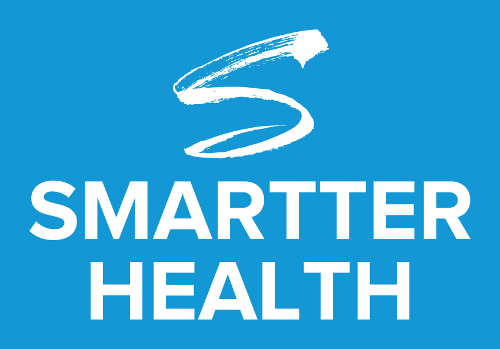

# Microsoft Graph Samples (React) 

This is a collection of packages that demonstrate how to connect to the Microsoft Graph using [React].

## Steps to Awesome

Navigate to the desired directory on your local machine, and run the following commands:

```
	git clone https://github.com/SmartterHealth/ms-graph-samples-react.git
```
You can also download the *.zip file, and extract to the desired directory on your local machine.

## Packages

* [OneDrive Sample](onedrive/README.md)

## Dependancies

* [Microsoft Authentication Library for JavaScript (MSAL)](https://www.npmjs.com/package/msal) 
* [React](https://www.npmjs.com/package/react)
* [ReactDOM](https://www.npmjs.com/package/react-dom)

## Development Dependancies

* [Gulp](https://www.npmjs.com/package/gulp)
* [TypeScript](https://www.npmjs.com/package/typescript)

## Resources
* [Microsoft Graph REST API v1.0 reference](https://docs.microsoft.com/en-us/graph/api/overview?view=graph-rest-1.0) 
* [React]

[React]:https://reactjs.org
