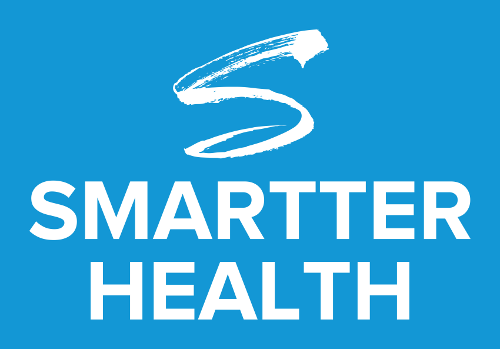

## OneDrive Sample 

# Steps to Awesome

Navigate to the ./onedrive directory, and run the following commands.

```
	npm install
	gulp serve
```

You can substitute **yarn** for **npm** if that is your preferred package manager.

## Resources
* [Microsoft Graph REST API v1.0 reference](https://docs.microsoft.com/en-us/graph/api/overview?view=graph-rest-1.0) 
* [React.js]
* [Working with files in Microsoft Graph](https://docs.microsoft.com/en-us/graph/api/resources/onedrive?view=graph-rest-1.0)

 [React.js]: (htps://reactjs.org)